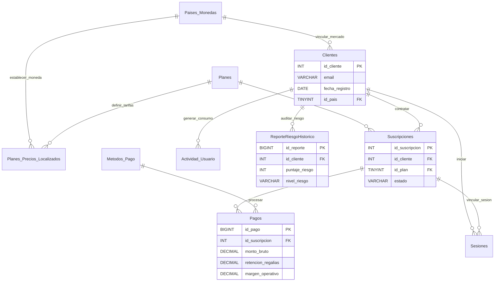

# 🎵 Streaming Retention Insights & Churn Analytics System

[](https://www.microsoft.com/sql-server)
[](https://www.python.org/)
[](https://pandas.pydata.org/)
[](#-arquitectura-y-diseño-de-base-de-datos)
[](#-estrategias-de-alto-rendimiento-sql)

> **Plataforma corporativa End-to-End para la mitigación del Churn y analítica financiera (MRR/LTV) en servicios de suscripción masivos.** 
> El sistema procesa millones de eventos de consumo mediante una arquitectura desacoplada en T-SQL y expone agregaciones ejecutivas automatizadas a través de un pipeline analítico en Python y Pandas.

---

## 🚀 Impacto de Ingeniería y Negocio

Este repositorio demuestra la resolución de problemas críticos de rendimiento y lógica financiera en plataformas a escala de producción:
* **Mitigación Financiera:** Cálculo preciso de pérdidas de ingresos recurrentes mensuales (*MRR Net Loss*) y valor de vida del cliente (*LTV*) por cohorte.
* **Escalabilidad de Consultas:** Eliminación total de cuellos de botella e hilos bloqueantes de lectura mediante el uso exhaustivo de expresiones de tabla común (*CTEs*) secuenciales.
* **Eficiencia en Infraestructura:** Reducción drástica de costos de cómputo en la nube mediante optimización de planes de ejecución y eliminación de escaneos de tablas completos.

---

## 📁 Arquitectura del Repositorio

```plaintext
.
├── 01_DDL_Maestro_E_Ingenieria_Datos.sql    # DDL multi-esquema (core/analytics) con reglas financieras determinísticas.
├── 02_Matriz_Retencion_Cohortes.sql          # Análisis analítico de cohortes (M0 a M6) optimizado sin subconsultas.
├── 03_Churn_Clientes_MRR_Y_LTV.sql           # Motor de contabilidad recurrente para métricas clave de negocio (SaaS/Streaming).
├── 04_Motor_Identificacion_Riesgo.sql        # Algoritmo de scoring predictivo basado en flags binarios comportamentales.
├── 05_Procedimiento_Almacenado_Riesgo.sql    # Stored Procedure transaccional con control de excepciones TRY...CATCH y auditoría.
├── 06_Optimizacion_E_Indices.sql             # Estrategia de indexación covering y filtrada para la eliminación de Key Lookups.
└── pipeline_pandas.py                        # Pipeline de abstracción ETL e integración analítica con SQLAlchemy y Pandas.
```

---

## ⚙️ Análisis Técnico Destacado

### 1. Arquitectura y Diseño de Base de Datos
El diseño implementa un enfoque de **separación de responsabilidades** dividiendo el entorno en dos esquemas lógicos independientes para proteger el rendimiento transaccional:
* **Esquema `core`:** Diseñado para la captura de eventos transaccionales de alta concurrencia (Suscripciones, Sesiones, Pagos).
* **Esquema `analytics`:** Optimizado para la lectura masiva de datos y agregaciones ejecutivas de BI.
* **Simulación No Bloqueante:** Implementación de una **Tally Table (`#Tally`)** para la generación masiva de datos sintéticos, evitando la fragmentación del B-Tree y previniendo *page splits* costosos durante las pruebas de carga.

```sql
-- Columnas calculadas determinísticas para automatización de la regla de negocio 70/30
retencion_regalias AS CAST(monto_bruto * 0.70 AS DECIMAL(10,2)),
margen_operativo   AS CAST(monto_bruto * 0.30 AS DECIMAL(10,2))
```

### 2. Algoritmos y Lógica de Negocio Avanzada
* **Scoring Comportamental:** Creación de un motor de reglas que evalúa 4 variables críticas de retención (tiempo de reproducción, cobros rechazados, proximidad de vencimiento e inactividad), consolidando un **Puntaje de Riesgo** (0 al 4).
* **Análisis de Cohortes:** Estructuración de matrices de retención mensual utilizando exclusivamente CTEs jerárquicas, garantizando un código mantenible y planes de ejecución eficientes.

### 3. Estrategias de Alto Rendimiento SQL
Para garantizar la viabilidad financiera del servidor de base de datos bajo alta demanda de lectura, se aplicaron técnicas avanzadas de indexación:
* **Eliminación de Key Lookups:** Diseño estratégico de índices no agrupados (*non-clustered*) con cláusulas `INCLUDE`, convirtiendo consultas pesadas en búsquedas puramente cubrientes (*covering queries*).
* **Índices Filtrados:** Reducción drástica del espacio en disco e índices en caché aplicando predicados selectivos (`WHERE activa = 1`), optimizando las búsquedas de sesiones simultáneas.

```sql
-- Estrategia de Índice Cubriente para mitigar la sobrecarga de I/O en lecturas concurrentes
CREATE NONCLUSTERED INDEX IX_Suscripciones_Fechas_Cliente
ON core.Suscripciones (fecha_inicio, fecha_fin)
INCLUDE (id_cliente, id_plan, estado);
```

---

## 📐 Modelo de Datos (ERD)



---

## 🐍 Pipeline Analítico (Python & Pandas)

Abstracción de la capa de datos mediante **SQLAlchemy** para orquestar la extracción de métricas analíticas e integrarlas en estructuras matriciales de alto rendimiento con **Pandas**:

```python
import pandas as pd
from sqlalchemy import create_engine

SERVER = 'localhost'
DATABASE = 'Streaming_Retention_Insights_v2'

connection_string = (
    f"mssql+pyodbc://@{SERVER}/{DATABASE}?"
    "driver=ODBC+Driver+17+for+SQL+Server&trusted_connection=yes"
)

engine = create_engine(connection_string)

def extraer_resumen_riesgo(min_puntaje: int = 2) -> pd.DataFrame:
    """Extrae el reporte de riesgo vía Stored Procedure y consolida métricas ejecutivas."""
    query = "EXEC sp_reporte_clientes_riesgo @GuardarHistorico = 0, @MostrarSoloRiesgo = 1;"
    
    with engine.connect() as conn:
        df = pd.read_sql_query(query, conn)
    
    df_filtrado = df[df['puntaje_riesgo'] >= min_puntaje]
    
    resumen = df_filtrado.groupby(['pais', 'nivel_riesgo']).agg(
        total_clientes=('id_cliente', 'count'),
        promedio_minutos=('promedio_minutos', 'mean'),
        pagos_fallidos=('pagos_fallidos', 'sum')
    ).reset_index()
    
    return resumen

if __name__ == '__main__':
    print(extraer_resumen_riesgo(min_puntaje=2))
```

---

## 🛠️ Ejecución Local

1. **Base de Datos:** Inicialice su instancia de SQL Server 2019+ y ejecute los scripts numerados de forma secuencial (`01` al `06`).
2. **Entorno Analítico:**
   ```bash
   pip install pandas sqlalchemy pyodbc
   python pipeline_pandas.py
   ```
